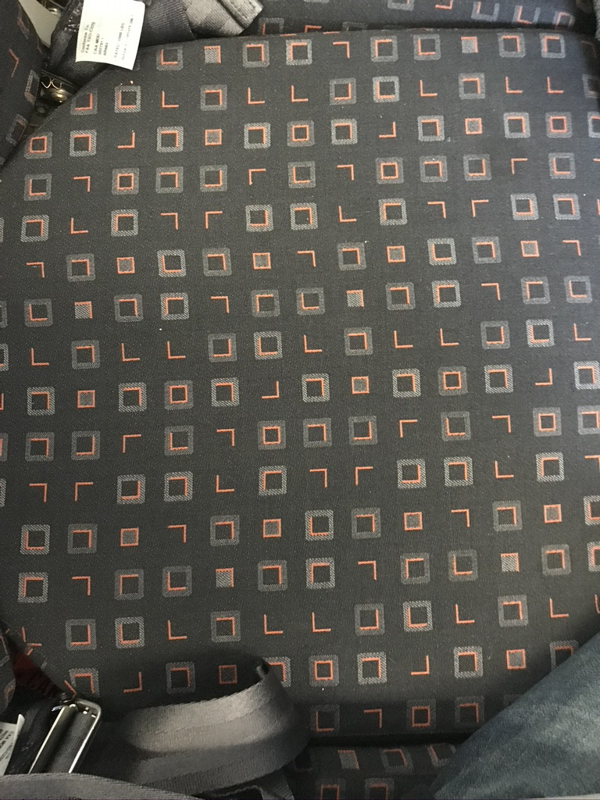

# EasyJet seat message
> HiDDeN CoNsPirAcY by the LiZaRd PeoPle?

This is an attempt to try to see if there is a hidden message in the seat patten present 
in EasyJet planes in A319, A320 and A321 of the non-neo type.
I have not gone insane, but after staring at the seat patten one starts to wonder if the pattern is random or not. It is:

* stitched ——fancy
* repeats perfectly —but the starting point changes between seats
* not seen rotated —picture below is rotated though
* there is a consistent square pattern of borders and fills —except for the rarer smaller inner, which appears with full border only
* the pattern is large 12&times;12 —but is a square, which makes a message harder.

I transcribed the pattern fully and faithfully, but did not get round to analysing it / switched to reading a book.

## Code

The `Square` class is instantiated with a `Border` and a `Line` enum.
`seated.pattern` is a list of list of `Square` instances, describing the seat pattern.
The pattern tessellates and can start at any column or row.

## To Do

* Make picture from pattern...
* Test whether random or cypher or a magic square or similar...
* Decode??

